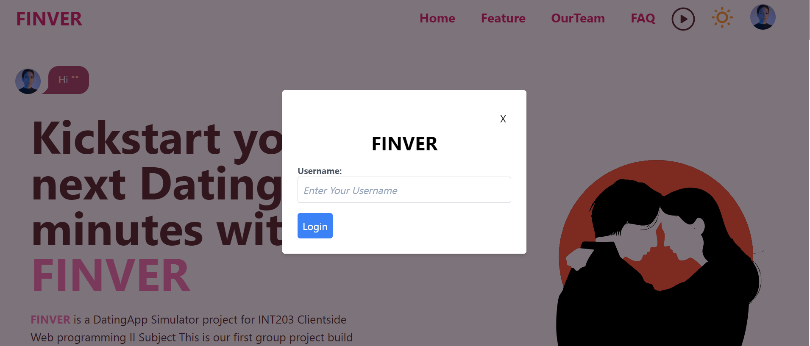
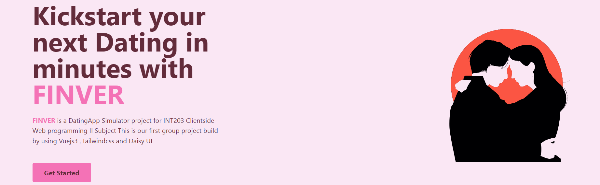
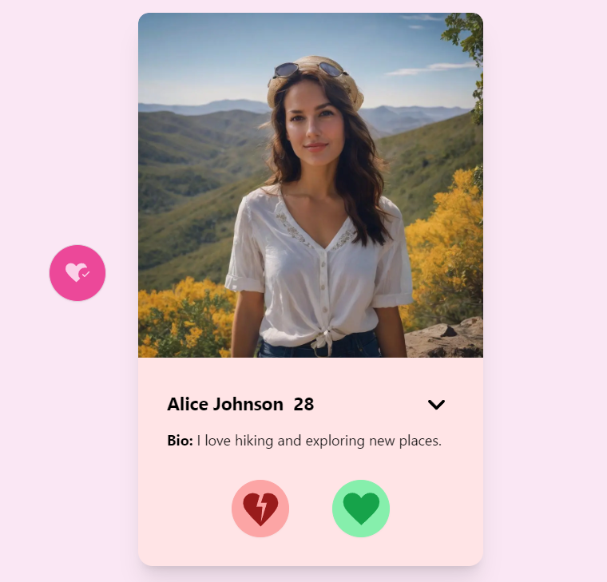
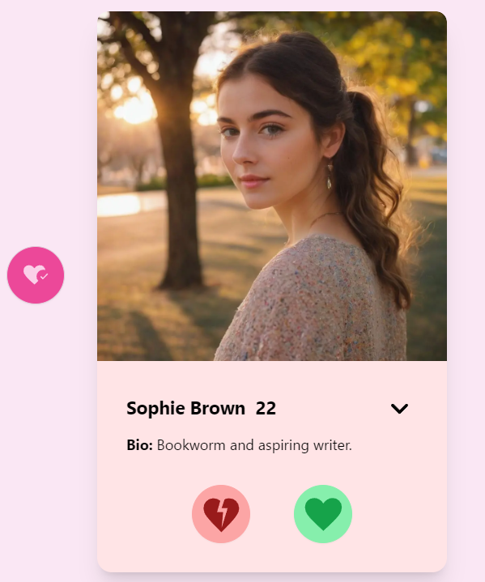
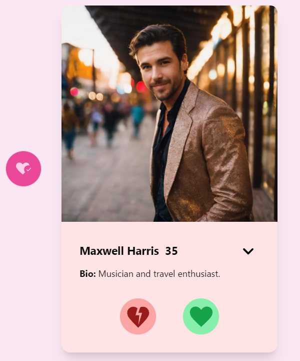
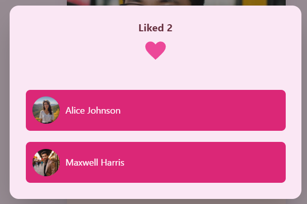
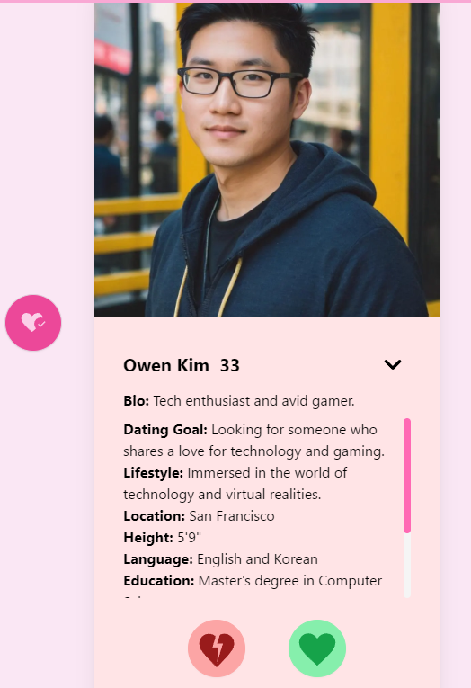
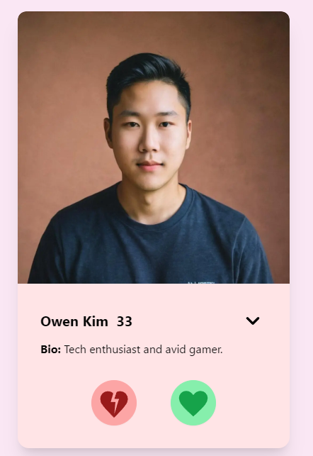
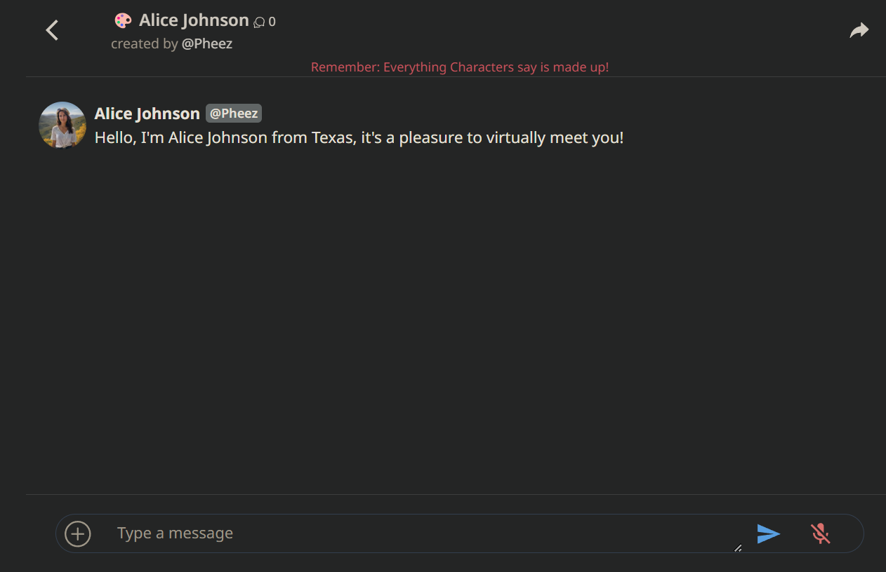
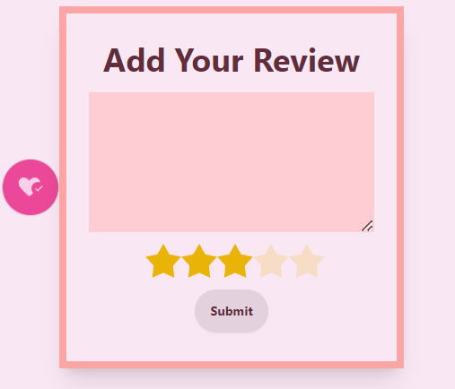

# FINVER - A Dating App Simulator
******
   ## *FINVER* is a DatingApp Simulator project for INT203 Clientside Web programming II Subject This is our first group project build by using
   ## [Vuejs3](https://vuejs.org/) , [tailwindcss](https://tailwindcss.com/) , [JavaScript](https://developer.mozilla.org/en-US/docs/Learn/Getting_started_with_the_web/JavaScript_basics) and [Daisy UI](https://daisyui.com/)
   
        
## Click here [FinverWebDemo](https://project-1-sec-1-finver.vercel.app/)
   ***************
## Features
### The features of our app are as follows:

- Basic Login System: A basic login system that displays the user's username while they are actively using the app.

- The music player button allows you to play our app along with some relaxing tunes while you search for your date.

- The system keeps track of the number of likes received by a profile

- Names and profile pictures of individuals who have been liked by the user are displayed.

- Dark Mode: An optional dark mode feature that users can toggle for a different visual experience

- Our app is responsive and supports playing on different screen sizes.

*******

## Getting Started
 - On the first page, users will see the login page where they can enter their username in the box and then click "Login"

- On the homepage, you will find the navigation bar at the top, which can take you to various sections of the app.

   * There is a *__music player button__* if you click on it, you will hear music theme  playing as you use the app.
 
   * The *__sun icon__* allows you to change the background color when clicked.
   * UserIcon When you click on the user icon, it displays the user's information.
  
   * *__Before__* clicking the sun icon:
   
  
   * *__After__* clicking the sun icon:
  

- Click on *__"Get Started"__* to begin your journey to find your date!

- After clicking "Get Started," you will be directed to the user's dating profile page. Here, you will find:
 
    * *__Green Heart__*: Click to like them and move on to the next person.
    
    * *__Red Heart__*: Click to skip to the next person.
    
    * *__Pink Heart__*: Shows who you've liked and how many people you've liked.
    
    * *__Dropdown__*: You can also click on the triangle icon to view more information about that person.
    
    * *__Mouse Scrolling__*: You can scroll the photos by hovering your mouse over the photo and scrolling.
    
    * *__Chat__*: You can click on the names of the people you like to start chatting with them right away!
    
- When you've finished scrolling through the dating profiles, don't forget to leave a star rating and comment!

*************
## Reference
### [TinderApplication](https://tinder.com/th) : The main inspiration for creating the pages and features of the FINVER app came from you. Thank you.
### [Character.ai](https://beta.character.ai/) : Used in the project to enhance the chat feature, which will link to the character.ai page. Thank You.

*************
## TEAM MEMBER
- ### 65130500003 Kittichai Chimchai (13%)
   * Develop a basic login system allowing users to input their username and display the result on the webpage
   * Implement a dropdown menu on the top navigation bar
   * Create a README file to explain the project
- ### 65130500011 Jiraplus Chanpong (17%)
   * Develop a responsive navigation bar
   * Design the main UI of the project, including color scheme and font selection
   * Implement a feature to play music within the chat
- ### 65130500027 Taned Thanyapanich (20%)
   * Decorate and arrange various components on the webpage.
   * Implement a review system for users.
   * Provide assistance in refining and enhancing code for peers, ensuring better code structure and quality.
- ### 65130500031 Nateetarn Likitwiwatphong (20%)
   * Implement Like and Dislike features
   * Develop a system to count the number of likes
   * Collaborate on creating a basic login system
- ### 65130500053 Pheeraphat Dherachaisuphakij (30%)
   * Create a JSON file for use on the webpage and demonstrate data presentation (Text, Image, Icon).
   * Introduce a system to remember individuals we have liked.
   * Take responsibility for ensuring the overall web UI responsiveness.
   * Act as the primary consultant for peers in the group, consolidating code from other members and improving its organization, arrangement, and coding.
